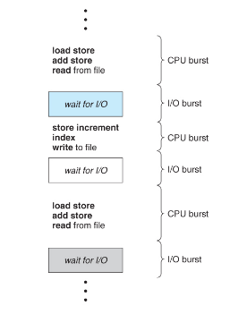
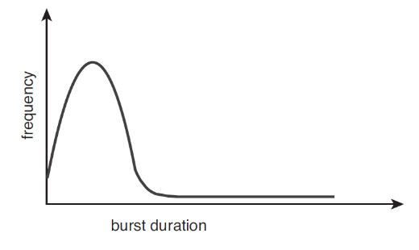

# 1 CPU Scheduling의 개념 및 기준
### 학습 목표
1. CPU 스케줄링이 무엇인지 학습
2. CPU - I/O  Brust Cycle이 무엇인지 학습
3. CPU Scheduler가 무엇인지 학습
4. 선점 스케줄링이 무엇인지 학습
5. 디스패처(Dispatcher)가 무엇인지 학습
6. 스케줄링 기준에 대해서 학습

## 1.1 CPU 스케줄링이란 무엇인가?
- 하나의 CPU는 한순간에 오직 하나의 프로세스만을 실행할 수 있다. 메모리 위에 올라가 있는 나머지 프로세스는 CPU가 자유 상태가 될때까지 기다려야 한다. 만약 CPU가 어떤 한 프로세스의 실행을 마치고 다른 프로세스를 실행한다면 어떤 프로세스를 선택할 것인가?
- CPU 스케줄링은 CPU가 다음에 수행할 프로세스의 실행 순서를 정하는 것을 의미한다.

## 1.2 CPU 입/츨력 버스트 사이클
- 프로세스 실행은 CPU 실행과 입/출력 대기의 사이클로 구성됨. 프로세스들은 CPU가 프로세스를 실행하는 상태와 입/출력을 위한 상태를 교대로 왔다갔다함.
- 
- 위의 그림을 보면 CPU burst상태는 프로세스의 명령어를 수행하는 상태이고, I/O burst 상태는 프로세스가 사용자로부터 입력받기를 기다리거나 명령어 수행 결과를 출력하는 상태.
- I/O burst 상태에서 CPU는 대기하게 된다. 하지만 CPU가 대기하는 것은 굉장한 낭비이다. 이러한 I/O burst 상태에서 다른 프로세스를 수행한다면 CPU의 효율은 더 커질것이다.

 

- 일반적으로 입/출력 중심의 프로그램은 짧은 CPU burst를 가질 것이다. 반대로 CPU 지향 프로그램은 긴 CPU burst를 가질것이다. 아래 그림은 burst 지속 시간에 따른 입/출력의 빈도수를 표현한 그래프이다.

- 
  
## 1.3 CPU 스케줄러란 무엇인가?
- CPU가 유휴 상태가 될 때마다, 운영체제는 준비 완료 큐에 있는 프로세스들 중에서 하나를 선택해 실행해야 한다.
- 선택 절차는 단기 스케줄러(또는, CPU스케줄러)에 의해 수행된다. 스케줄러는 실행 준비(ready)가 되어 있는 메모리 내의 프로세스들 중에서  선택하여, 이들 중 하나에게 CPU를 할당한다.

 

- 준비 완료 큐는 일반적인 FIFO 방식의 큐도 되고 우선순위를 부여한 우선순위 큐가 될 수도 있다.

 

- 정리하면 CPU 스케줄러는 실행 준비가 되어 있는 프로세스들 중에서 하나를 선택하여 CPU에게 할당해주는 역할을 수행한다.

## 1.4 선점 스케줄링(Preemptive Scheduling)과 비선점 스케줄링(Non-Preemptive Scheduling)
### 비선점 스케줄링은 무엇인가?
- 비선점 스케줄링은 CPU가 현재 실행중인 프로세스가 완료될때까지 다른 프로세스들은 대기하는 스케줄링을 의미함. 오직 현재 실행중인 프로세스가 종료되거나 입/출력을 위하여 대기 상태(wating state)로 들어가는 경우에만 다른 프로세스들이 실행할 수 있다.
 

### 선점 스케줄링은 무엇인가?
- 선점 스케줄링은 CPU가 현재 프로세스를 실행중일때 스케줄러에 의해 현재 프로세스의 CPU 제어권을 다른 프로세스한테 넘기는 스케줄링을 의미한다.
- 실행중인 프로세스가 다른 프로세스에게 CPU 제어권을 선점당하면 Runnig 상태에서 Ready 상태로 변하고 입/출력을 위하여 대기 중인 상태에서 다른 프로세스가 CPU를 선점하면 Ready 상태로 전환된다.

### 프로세스의 4가지 상황에 따른 CPU 스케줄링 결정
1. 한 프로세스가 실행 상태에서 대기 상태로 전환 될 때(예를 들어, 입/출력 요청 등)
2. 프로세스가 실행 상태에서 준비 완료 상태로 전환 될 때(예를 들어 다른 프로세스의 인터럽트 발생)
3. 프로세스가 대기 상태에서 준비 완료 상태로 전환 될 때(예를 들어, 입/출력의 종료)
4. 프로세스가 종료할 때

- 1,4번 상황에서만 스케줄링이 발생한 경우 비선점 스케줄링입니다. 2,3번 상황에서 스케줄링이 발생한 경우 비선점 스케줄링을 할수도 있고 선점 스케줄링을 할 수 있다.

## 1.5 디스패처(Dispatcher)란 무엇인가?
- CPU 스케줄링 기능에 포함된 또 하나의 요소는 디스패처(Dispatcher)이다.
- **디스패처는 CPU의 제어를 단기 스케줄러가 선택한 프로세스에게 주는 모듈**이며 다음과 같은 작업을 포함한다.
- 1. 문맥을 교환하는 일(Context Switching)
- 2. 사용자 모드로 전환하는 일
- 3. 프로그램을 다시 시작하기 위해 사용자 프로그램의 적절한 위치로 이동(jump)하는 일.
- 디스패처는 모든 프로세스의 문맥 교환시 호출되므로, 가능한 한 빨리 수행되어야 한다.

 

### 디스패치 지연(dispatch latency)란 무엇인가?
- 디스패처가 하나의 프러세스를 정지하고 다른 프로세스의 수행을 시작하는 데까지 소요되는 시간을 의미함.

## 2 스케줄링 기준(Scheduling Criteria)
- CPU 스케줄링 알고리즘을 비교하기 위한 여러 기준은 다음과 같다.
- 1. CPU 이용률(CPU Utilization): CPU이용률은 0에서 100%까지 이른다. 실제 시스템에서는 40% ~ 90%까지의 범위를 가져야함.
- 2. 처리량(Throughout): 처리량은 단위 시간당 완료된 프로세스의 개수이다. 긴 프로세스의 경우에는 이 비율은 시간 당 한 프로세스가 될 수도 있고, 짧은 트랜잭션인 경우 차리량은 초 당 10개의 프로세스가 될 수도 있다.
- 3. 총처리 시간(Turnaround Time): 총처리 시간은 프로세스의 제출 시간과 완료 시간의 간격임. 즉, 메모리에 들어가기 위해 기다리며 소비한 시간과 준비 완료 큐에서 대기한 시간, CPU에서 실행하는 시간, 입/출력 시간을 합한 시간이다.
- 4. 대기 시간(Wating Time): 대기 시간은 준비 완료 큐에서 대기하면서 보낸 시간의 합이다.
- 5. 응답 시간(Response Time): 응답 시간은 하나의 요구를 제출한 후 첫번째 응답이 나올 때까지의 시간이다.  

