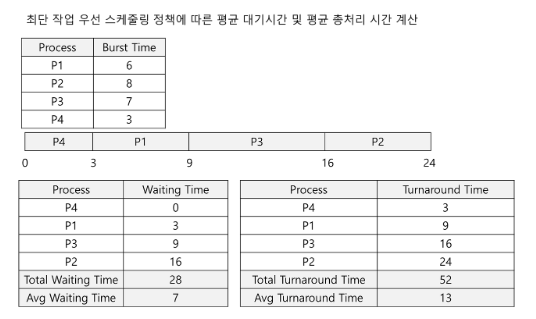
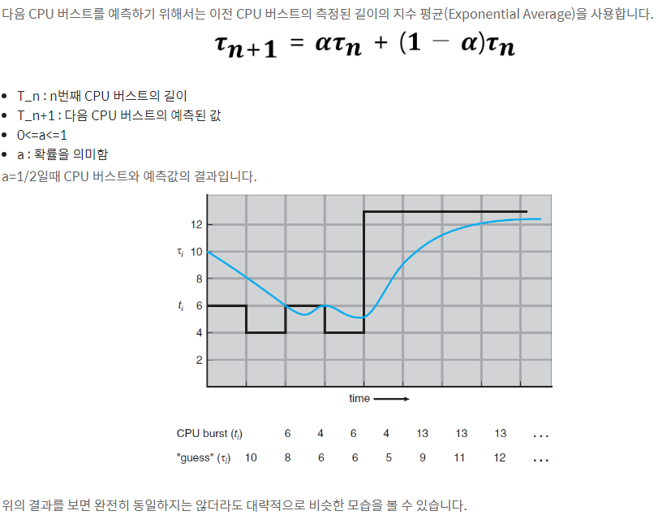

## 학습목표
1. 선입 선처리 스케줄링
2. 최단 작업 우선 스케줄링에 대해서 학습

 

# 1. 선입 선처리 스케줄링(FCFS)
- 먼저 요청하는 프로세스가 CPU를 먼저 할당받음. 이러한 정책은 큐 자료구조로 관리함.
- 문제점: 평균 대기 시간이 매우 길수 있음.
- FCFS는 비선점형이다.

# 2. 최단 작업 우선 스케줄링(Shortest-Job-First-Scheduling)
- **CPU가 이용 가능해지면, 가장 작은 다음 CPU버스트를 가진 프로세스에게 할당시킴**
- 만약 길이가 동일하다면 선입 선처리 스케줄링을 적용함
- 
 

## SJF 알고리즘의 어려움
- SJF 알고리즘의 어려움은 다음 CPU 요청의 길이를 파악하는 것
- 따라서 SJF 스케줄링은 장기 스케줄링에서 자주 사용된다.

 

- SJF 알고리즘이 최적이긴 하지만, 단기 CPU 스케줄링 수준에서는 구현할 수 없다. 왜냐하면 CPU버스트의 길이를 알 수 있는 방법이 없기 때문이다.
- 하지만 SJF 스케줄링의 근사치를 구하기 위하여 다음 CPU의 길이를 예측하는 것은 가능할 것이다.
- 그리고 예측한 CPU 버스트를 가지는 프로세스를 선택하면 됨.
- 
 

## 선점형 SJF 스케줄링과 비선점형 SJF스케줄링
- SJF 스케줄링은 선점형이거나 또는 비선점형일 수 있다.
- 앞의 프로세스가 실행되는 동안 새로운 프로세스가 준비 완료 큐에 도착하면 선택이 발생한다.
- 새로운 프로세스가 현재 실행 되고 있는 프로세스의 남은 시간보다도 더 짧은 CPU버스트를 가질 수도 있다 -> 선점형은 현재 신행하는 프로세스를 선점할것. 반면에 비선점형 SJF는 현재 실행하고 있는 프로세스가 자신의 CPU버스트를 끝내도록 허용할 것이다. 