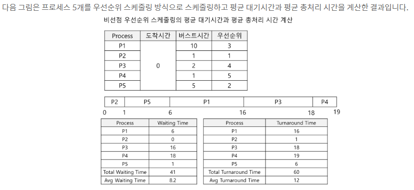
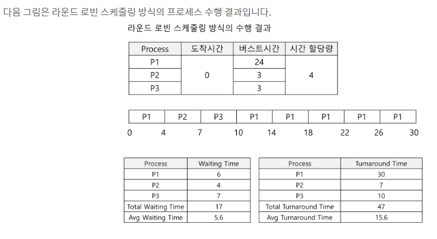
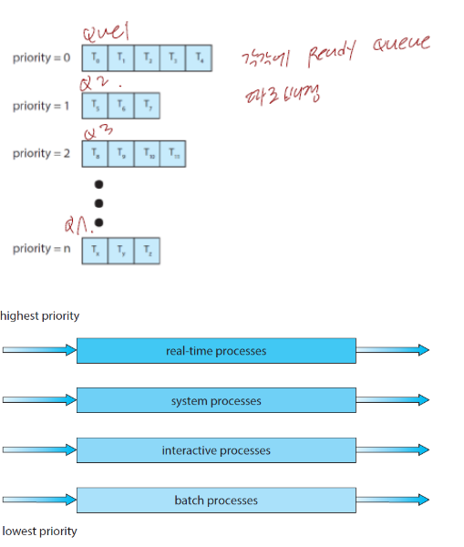
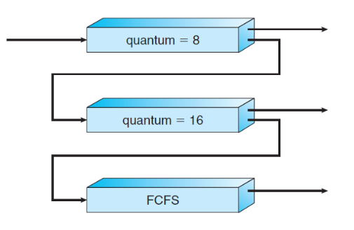

## 학습목표
1. 우선순위 스케줄링에 대하여 학습
2. 라운드 로빈 스케줄링에 대하여 학습
3. 다단계 큐 스케줄링에 대하여 학습
4. 다단계 피드백 큐 스케줄리에 대하여 학습
  
# 1. 우선순위 스케줄링(Priority Scheduling)
- 우선순위 스케줄링 방식은 각각의 프로세스들은 우선순위를 가지고 있으며 가장 높은 우선순위를 가진 프로세스에게 CPU권한을 할당함.
- 만약 우선순위가 같은 프로세스가 있다면 FCFS순서로 스케줄링함.
- 일반적으로 우선순위는 0~7 또는 0~4095까지 일정 범위의 수를 사용한다. 이중에서 0이 최상위 우선순위이다.
- 
**내부적 우선순위 정의 기준**
- 시간 제한
- 메모리 요구
- 열린 파일의 수
- 평균 입/출력 버스트의 평균 CPU 버스트에 대한 비율

 

**외부적 우선순위 정의 기준**
- 프로세스의 중요성

 

## 우선순위 스케줄링의 선점형/ 비선점형
- 프로세스가 준비 완료 큐에 도착하면, 새로 도착한 프러세스의 우선순위를 현재 실행중인 프로세스의 우선순위와 비교한다. 선점형 우선순위 스케줄링 알고리즘은 새로 도착한 프로세스의 우선순위가 현재 실행되는 프로세스의 우선순위보다 높다면 CPU를 선점한다. 비선점형 우선순위 스케줄링 알고리즘은 단순히 준비 완료 큐의 머리 부분에 새로운 프로세스를 넣는다.

## 우선순위 스케줄링 알고리즘의 문제점
- 우선순위 스케줄링 알고리즘의 주요 문제는 **무한봉쇄(indefinite blocking)** 또는 **기아 상태(starvation)**이다. 이 문제는 실행 준비는 되어 있으나 CPU를 사용하지 못하는 프로세스는 CPU를 기다리면서 봉쇄된 것으로 간주될 수 있다. 우선순위 스케줄링 알고리즘을 사용할 경우 **낮은 우선순위 프로세스들이 CPU를 무한히 대기하는 경우가 발생**한다.

## 우선순위 스케줄링 알고리즘의 해결방법
- 낮은 우선순위의 프로세스들이 무한히 봉쇄하는 문제에 대한 한 해결 방안은 노화(aging)이 있다. 노화란 오랫동안 시스템에서 대기하는 프로세스들의 우선순위를 점진적으로 증가시키는 기법
- 예를 들어, 우선 순위가 127(낮음)에서 0(높음)까지의 범위라면, 매 15분 마다 대기중인 프로세스의 우선순위를 1씩 증가시킬 수 있다.

# 2 라운드 로빈 스케줄링(RR)
- 라운드 로빈 스케줄링은 선입 선처리 스케줄링과 유사하지만 프로세스들 사이를 옮겨다니기 위해 **선점이 추가**된 스케줄링이다.
- 대표적인 특징은 **시간 할당량(time quantum)** 또는 시간 조각이라고 하는 작은 단위의 시간을 정의한다. 시간 할당량은 일반적으로 10에서 100밀리초이다.
- 준비 완료 큐로 동작한다. CPU 스케줄러는 준비 완료 큐를 돌면서 **한번에 한 프로세스에게 한번의 시간 할당량 동안 CPU를 할당** 한다.

 

- 정리하면 **라운드 로빈 스케줄링은 시간 할당량을 정의하고 원형 큐에 프로세스들을 넣은 다음 각 프로세스에게 정의한 시간 할당량 만큼 CPU를 할당시키고 수행**시키는 스케줄링 방식이다.

 

**프로세스의 CPU 버스트 길이가 시간 할당량 보다 짧은 경우**
1. 프로세스 자신이 CPU를 자발적으로 방출
2. 스케줄러는 준비 완료 큐에 있는 다음 프로세스로 진행함.

**프로세스의 CPU 버스트 길이가 시간 할당량보다 긴 경우(아직 작업이 완료가 안된 상태)**
1. 타이머가 끝나면 운영체제에게 인터럽트를 발생시킴
2. 문맥 교환(Context Switch) 수행
3. 실행하던 프로세스는 준비 완료 큐의 꼬리에 넣음.

 

**라운드 로빈 스케줄링의 특징**
- 라운드 로빈 스케줄링 방식하의 평균 대기 시간은 종종 길어질 수 있음.
- 라운드 로빈 스케줄링의 성능은 시간 할당량의 크기에 매우 많은 영향을 받음.
- 시간 할당량이 매우 적어지면 처리기 공유가 됩니다. n개의 프로세스들이 실제 처리기의 1/n 속도로 실행되는 자신의 처리기를 가지고 있는것처럼 사용자에게 보여지게 됩니다.
- 시간 할당량이 너무 적어지면 문맥 교환이 라운드 로빈 스케줄링의 성능에 미치는 영향을 고려해야 합니다. 문맥 교환 시간보다 시간 할당량이 더 적다면 프로세스가 수행이 되지 않을 것입니다.

 

# 3 다단계 큐 스케줄링(Multilevel Queue Scheduling)
- **다단계 큐 스케줄링 알고리즘은 준비 완료 큐를 다수의 별도의 큐로 분류하여 수행하는 방식**이다. 
- 프로세스들은 메모리 크기, 프로세스의 우선순위 혹은, 프로세스 유형(포어그라운드, 백그라운드)과 같은 특성에 따라 다수의 큐 중 한 개의 큐에 영구적으로 할당된다.
- 각각의 큐는 자신만의 스케줄링 알고리즘을 갖고 있다.
- 예를 들어, 포어그라운드와 백그라운드 프로세스들을 위해 별도의 큐를 사용할 수 있다. 포어그라운드 큐는 RR알고리즘에 의해 스케줄링될 수 있고 백그라운드 큐는 선입 선처리 알고리즘에 의해 스케줄링될 수 있다.
- 
- 위의 그림에서 각 큐는 낮은 우선순위 큐보다 절대적인 우선순위를 가진다.
- 예를 들어 실시간 프로세스, 시스템프로세스를 위한 큐들이 모두 비어 있지 않으면, 대화형 프로세스 큐에 있는 프로세스는 실핼될 수 없다.그리고 대화형 프로세스 큐에 있는 프로세스가 실행중에 높은 우선순위릐 큐에 프로세스가 들어오면 대화형 프로세스 큐의 프로세스들은 선점될 것이다.
 

- 정리하면 **다단계 큐 스케줄링 알고리즘은 프로세스들간의 우선순위를 정의하고 각 우선순위간의 큐를 생성하여 수행하는 방식이다. 높은 우선순위의 큐의 프로세스가 비어있지 않으면 낮은 우선순위 큐의 프로세스는 실핼될 수 없다.

# 4 다단계 피드백 큐 스케줄링(MFQ Multilevel Feedback Queue Scheduling)
### 다단계 큐 스케줄링의 단점
- 다단계 큐 스케줄링 알고리즘에서는 일반적으로 프로세스들이 시스템 진입 시에 영구적으로 하나의 큐에 할당됨. 예를들어, 포어그라운드와 백그라운드 프로세스를 위해 별도의 큐가 있을 경우, **프로세스들은 한 큐에서 다른 큐로 이동하지 못한다**. 왜냐하면 프로세스들이 포어그라운드와 백그라운드의 특성을 바꾸지 않기 때문이다. 이러한 방식은 적은 스케줄링 오버헤드가 장점이지만 융통성이 적다는 단점이 존재.
- 

### 다단계 피드백 큐 스케줄링 알고리즘의 방식
- 다단계 피그백 큐 스케줄링 알고리즘에서는 프로세스가 큐들 사이로 이동하는 것을 허용한다.
- 프로세스들을 CPU 버스트 성격에 따라 구분한다. -> 어떤 프로세스가 CPU의 시간을 너무 많이 사용하면, 낮은 우선순위의 큐로 이동된다. 그리고 입/출력 중심의 프로세스와 대화형 프로세스들은 높은 우선순위의 큐에 넣는다. 낮은 우선순위의 큐에서 너무 오래 대기하는 프로세스는 높은 우선순위의 큐로 이동할 수 있다. 이러한 노화(aging) 형태는 기아 상태를 예방한다.

 

- 예를 들어 번호가 0에서 2까지인 3개의 큐를 가진 다단계 피드백 큐 스케줄러를 가졌다고 가정한다. 스케줄러는 처음에 큐 0의 모든 프로세스들을 실행시킨다. 큐0번이 비어있을때만 큐1에 있는 프로세스들을 실행시킨다. 2번도 0번과 1번이 비어있을때만 실행된다. 큐 1번에 도착한 프로세스는 큐2번에 잇는 프로세스를 선점할 것이다.
- 준비 완료 큐에 들어오는 프로세스는 큐 0번에 넣어진다. 위 그림과 같이 큐0번에 있는 프로세스는 8밀리초의 시간 할당량이 주어진다. 만약 프로세스가 이 시간안에 끝나지 않는다면 큐1번의 꼬리로 이동한다. 큐 1번은 큐0번이 비어있다면 16밀리초의 시간 할당량이 주어진다. 여기서도 프로세스가 완료되지 않으면 FCFS방식의 큐인 큐 2번으로 들어간다.
 

- CPU 버스트가 짧은 프로세스들은 8밀리초를 할당받은 큐에서 완료되어 서비스를 빨리 받게 된다. 반대로 긴 프로세들은 계속 뒤의 큐로 가게되어 마지막에는 선입 선처리 방식으로 수행하게 된다.
 

- 정리하면 다단계 피드백 큐 스케줄링 알고리즘의 방식은 여러개의 큐에 시간 할당량을 정의하고 수행시간이 긴 프로세스일수록 뒤의 큐로 넣어지게 되는 방식이다.