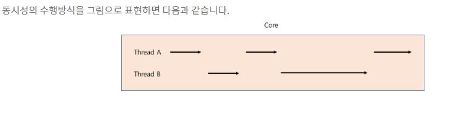
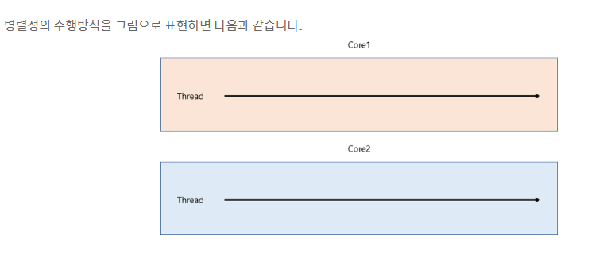
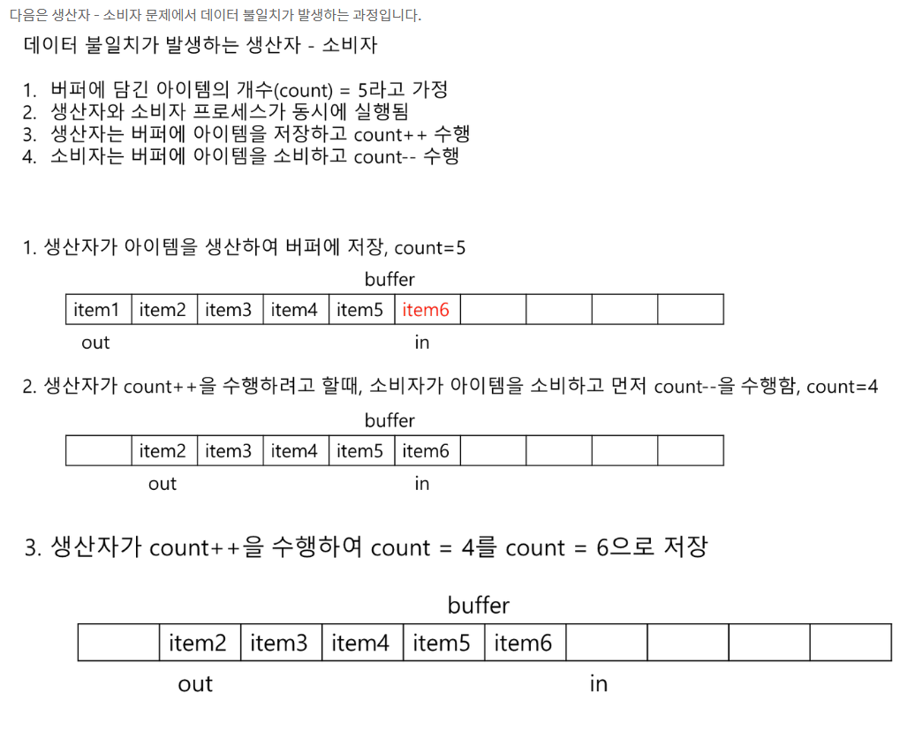

# 프로세스 동기화의 배경(필요성)
## 상호 협력적 프로세스들(Cooperating Processes)의 특징
- 상호협력적인 프로세스들은 서로 영향을 주거나 받을 수 있다.
- 상호협력적인 프로세스들은 논리적인 주소 공간(대표적인 것이 쓰레드)을 공유하거나 공유 데이터를 공유한다. 공유 데이터 방식은 다음과 같은 방식이 있다.
- 1. **공유 메모리(shared memory)방식**: 메모리 특정 영역에 여러 프로세스들이 자원을 공유할 수 있는 공간을 생성하고 자원을 공유하는 방식.
- 2. **메시지 전송 방식(message passing)방식**: 여러 프로세스들끼리 네트워크를 통해서 링크를 연결하고 메시지를 주고 받는 방식이다.

## 상호 협력적 프로세스들의 문제
- 상호 협력적인 프러세들이 공유 데이터에 **동시적으로 접근**하는 것은 **데이터 불일치(data inconsistency)**가 방생할 수 있다.
- 데이터 불일치를 해결하기 위한 방법
  - 데이터 불일치를 해결하기 위해서는 논리적인 주소 공간을 공유하는 상호 협력적 프로세스들의 **순서가 있는 실행(orderly execution, 동기화)이 보장**되어야 한다.

### 데이터 불일치가 발생하는 배경
데이터의 불일치가 발생하는 경우는 다음과 같이 여러개의 프로세스들(또는 쓰레드들)이 실행하는 경우에 발생.
1. **동시 실행(cocurrent execution, 동시성)**
   - 어떤 한 프로세스가 실행하는 중에 인터럽트가 발생하고 CPU 코어의 제어권을 또 다른 프로세스에게 선점될 수 있다.
   -  선점한 다른 프로세스는 기존 프로세스가 접근하고 있는 공유 자원에 접근하여 값을 바꾸는 상황이 발생하여 데이터의 불일치가 발생할 수 있다.

2. **병렬 실행(parallel execution, 병렬성)**
   - 병렬 실행이란 2개 이상의 CPU 코어를 통해서 하나의 프로세스를 처리하는 것.
   - 병렬 실행의 대표적인 특징은 각각의 CPU 코어들이 하나의 프로세스를 실행한다는 점이다.
   - 하지만 병렬 실행중 하나의 공유 자원을 CPU 코어를 할당받은 쓰레드들이 접근한다면 데이터 불일치가 발생할 수 있다.

## 동시성과 병렬성의 차이는 무엇인가?
<br/>

### 동시성
동시성은 **적어도 두 개의 스레드**가 진행중일때 존재하는 조건이며, 가상 병렬 처리의 한 형태로 시간 분할(time-slicing)을 포함한다. 즉, 가상 병렬 처리라는 의미는 **CPU 코어가 한번에 하나의 명령어만을 처리**한다는 의미이다. 두 개 이상의 알고리즘이  하나의 CPU코어에서 스레드간에 빠르게 **교차(문맥교환, Context Switching)**되면서 실행되기 때문에 '동시'라고 느끼는 것이다. 
<br/>

정리하면 **동시성은 하나의 CPU 코어 내에서 여러 프로세스(또는 쓰레드)들을 빠르게 교차하면서 한번에 하나의 명령어만을 수행하는 방식**이다. 동시성이라는 의미는 이러한 수행속도가 너무나 빨라서 마치 동시에 수행되는 것처럼 느끼는 것.



### 병렬성
병렬성의 수행 조건은 적어도 **2개 이상의 CPU 코어**가 있어야 한다. **병렬성의 수행 방식은 각각의 CPU코어가 하나의 프로세스(또는 쓰레드)를 맡아서 실행한다는 점**이다. 
- 동시성과는 비슷하지만 핵심적인 차이점은 동시성의 수행방식은 하나의 단일 CPU코어 내에서 쓰레드들을 교차하면서 수행한다면 병렬성의 수행방식은 교차하지 않고 각각의 쓰레드를 수행한다.
- 
<br/>


- 위 수행과정과 같이 생산자 또는 소비자가 버퍼와 count변수에 접근하여 조작하는 과정에서 다른 프로세스(생산자, 소비자)가 현재 실행중인 프로세스를 선점하고 버퍼 또는 count 변수에 값을 업데이트한다면 데이터 불일치가 발생할 것이다.

### 왜 생산자-소비자 문제에서 count 변수는 데이터 불일치가 발생하는가?
위 문제를 분석하기 위해서 count 값이 어떻게 잘못될 수 있는지 다음과 같이 보일 수 있습니다. "count++"는 다음과 같이 기계어로 구현될 수 있습니다.
```
register1 = count
register1 = register1 + 1
count = register1
```

위에서 register1은 한 CPU만 접근할 수 있는 지역 레지스터입니다. 마찬가지로 "count--"는 다음과 같이 구현될 수 있습니다.
<br/>

```
register2 = count
register2 = register2 + 1
count = register2
```

위 레지스터의 내용은 인터럽트 처리기에 의하여 메모리에 잠시 보관되었다가 다시 적재됩니다.

 "count++"와 "count--" 문장을 병행하게 실행하는 것은 앞에서 제시한 저수준의 문장들을 임의의 순서로 뒤섞어 순차적으로 실행하는 것과 동등합니다.(그러나 각 고수준 문장 내에서의 순서는 유지됨). 그 중 하나는 다음과 같은 순서를 가질 수 있습니다.

 ```
 T0 : 생산자가 register1 = count를 수행         {register1 = 5}
T1 : 생산자가 register1 = register1 + 1을 수행 {register1 = 6} => 소비자 프로세스로 context switch 발생
T2 : 소비자가 register2 = count를 수행         {register2 = 5}
T3 : 소비자가 register2 = register2 - 1을 수행 {register2 = 4}
T4 : 생산자가 count = register1을 수행         {count = 6}
T5 : 소비자가 count = register2을 수행         {count = 4}
 ```

 - 위와 같이 count 변수에 register1,2가 저장되기 전에 프로세스의 문맥교환(Context Switch)이 발생하게 되면 counte 변수는 부정확한 값이 저장됩니다.

 

- 위와 같이 생산자-소비자 문제를 통하여 생산자 프로세스와 소비자 프로세스가 수행중에 공유자원을 얻기 위해 다른 프로세스를 선점하는 상태를 경쟁 상태(Race Condition)이라고 합니다.

 

경쟁 상태(Race Condition)가 발생하는 조건
- 여러개의 프로세스(또는 쓰레드)가 존재하는 경우
- 같은 공유자원에 동시에 접근하고 갱신하는 경우
위와 같은 조건에서 여러개의 프로세스가 접근한 결과는 공유자원에 접근하는 프로세스들의 순서에 달려있습니다. 

 

경쟁 상태를 막기 위한 방법
- 오직 한순간에 하나의 프로세스만이 공유 자원에 접근해야 합니다. (예를 들어 count 변수가 있습니다.)