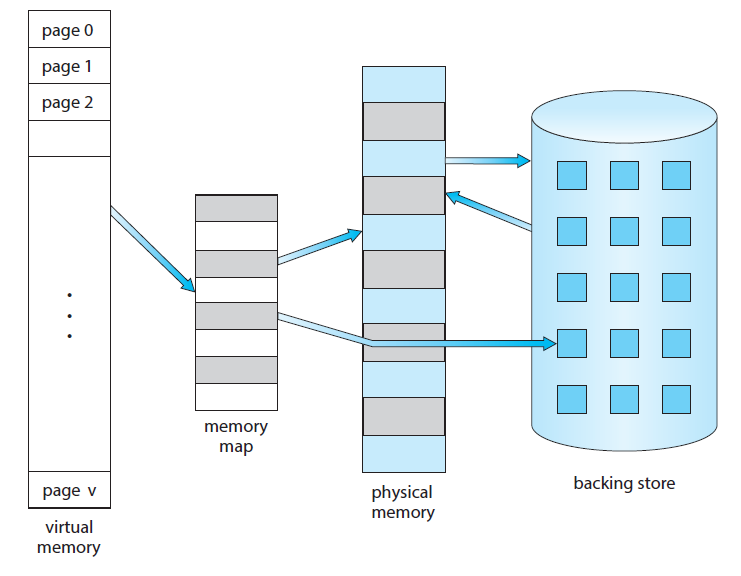
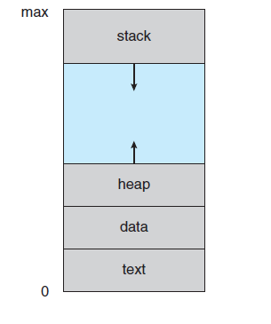
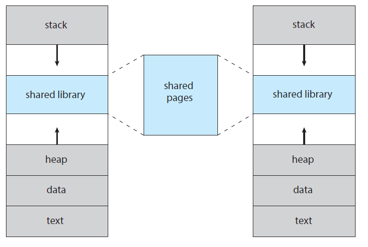
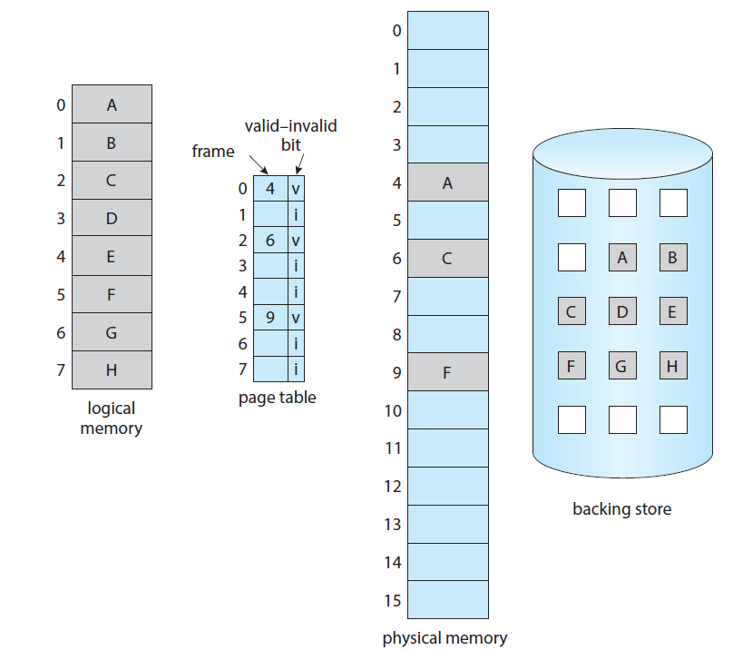
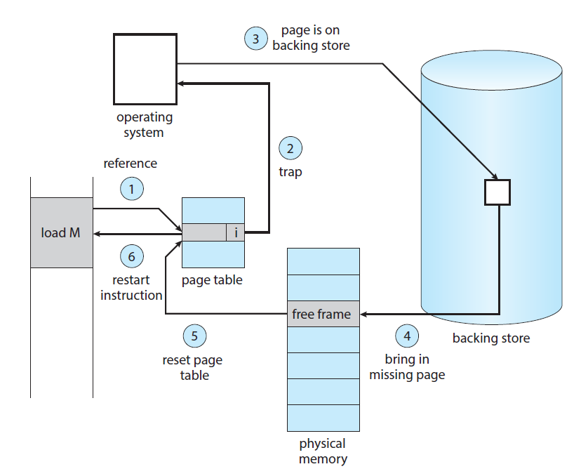
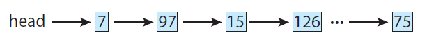
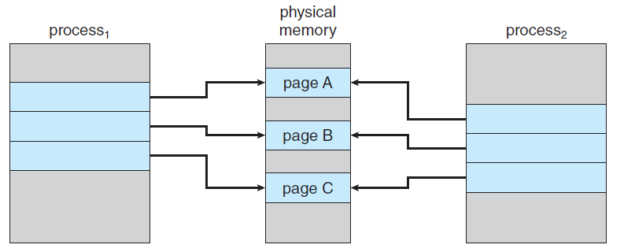
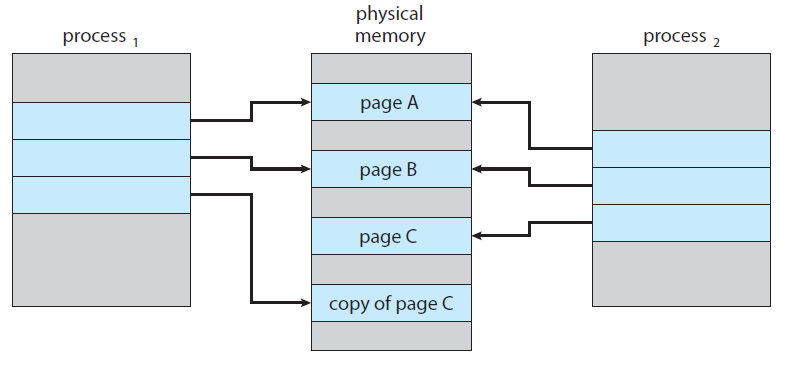

# 1. 가상 메모리의 배경
### 가상 메모리(Virtual Memory)
- 물리적인 메모리 크기보다 더 큰 크기의 프로그램을 실행시키기 위한 기술
- 가상 메모리 기술은 파일 공유와 라이브러리, 프로세스 생성과 같은 효율적인 메커니즘을 제공합니다.
다음 그림은 물리적인 메모리 크기보다 큰 가상메모리를 보여줍니다.


- 가상 메모리에 올라간 페이지들을 메모리 맵을 통해서 물리적인 메모리 공간에 매핑시킵니다.
- 실제 물리적인 메모리에 올라간 페이지들을 제외한 나머지 페이지들은 보조기억장치인 Backing Store에 저장됩니다.
 

### 가상 주소 공간(Virtual Address Space)
- 가상 주소 공간은 프로세스가 메모리에 어떻게 저장되는 방법에 대한 논리적(또는 가상의) 뷰입니다.
- 논리적 주소는 0부터 시작하고 이 가상 주소 공간은 연속적인 메모리에 올린 것처럼 존재하게 됩니다.


### 가상 메모리(Vritual Memory)
- 가상 메모리의 페이지 공유(page sharing) 기술를 통하여 2개 이상의 프로세스에 의해서 파일과 메모리를 공유하는 것을 허용합니다.
다음 그림은 가상 메모리 기술을 사용하여 라이브러리를 공유하는 프로세스를 표현한 것입니다.


 

# 2. 디맨드 페이징(Demand Paging)
- 프로그램을 실행하기 위해서는 보조기억장치에서 메모리로 적재하는 작업을 수행되어야 합니다.  
- 프로그램 전체를 물리적인 메모리에 적재하는 것은 첫번째 옵션입니다.
- **디맨드 페이징은 실행중에 요청할때만 페이지를 적재하는 전략입니다.**
- 디맨드 페이징은 가상 메모리 시스템에서 일반적으로 사용됩니다.
 

### 디맨드 페이징의 개념
- 프로세스가 실행중일때 몇몇 페이지들은 메모리에 있을 것이고 몇몇은 보조기억장치에 있을 것입니다.
- 페이지들이 메모리에 있는지 보조기억장치에 있는지 표시하기 위해서 valid-invalid bit가 사용됩니다.
  - valid : 페이지가 메모리에 존재함
  - invalid : 페이지가 유효하지 않은 페이지이거나 보조기억장치에 존재함


위 그림을 보면 A 페이지의 페이지 번호는 0번이고 물리적인 메모리에 4번 프레임에 저장됩니다. 페이지 테이블에서 0번의 valid-invalid bit가 v이므로 A 페이지는 물리적인 메모리에 존재함을 알 수 있습니다. 예를 들어 6번 페이지인 G가 페이지 테이블에서 valid-invalid bit가 i이면 페이지 G는 보조기억장치에 있다는 것을 의미합니다. 이렇게 **페이지가 보조기억장치에 있는 상황을 Page Fault**라고 합니다.

 <br/>

### Page Fault 처리 수행 과정
1. 해당 페이지가 유효한지 유효하지 않은 메모리 접근인지 판단하기 위해서 내부 테이블를 확인합니다.
2. 만약 페이지가 유효한 경우에는 그대로 처리해주면 되고 유효하지 않은 페이지라면 페이지 폴트(Page Fault)이므로 해당 페이지를 보조기억장치에서 메모리에 올려주어야 합니다.
3. free-frame 리스트를 사용하여 비어있는 프레임을 탐색합니다.
4. 보조기억장치로 가서 올리고자 하는 페이지를 읽어서 새롭게 할당된 프레임에 스케줄링합니다.
5. 보조기억장치 읽는 것이 완료되면 내부 테이블과 페이지 테이블을 지금 메모리에 페이지가 있다고 수정합니다.
6. 다시 프로세스를 재개합니다.


1. 특정 메모리를 접근하기 위해서 페이지 테이블을 참조합니다.
2. 해당 페이지 참조가 유효하지 않으므로 운영체제에 의해서 트랩(trap)됩니다. 운영제제 입장에서는 페이지 폴트가 일어 났다고 판다합니다.
3. 운영체제는 Backing Store(보조기억장치)로 이동합니다.
4. 보조기억장치에 있는 페이지를 물리적인 메모리의 비어있는 프레임에 적재합니다.
5. 페이지 테이블에서 해당 페이지 번호의 valid-invalid bit를 i에서 v로 변경합니다.
6. 프로세스 실행을 재개합니다.
 

### 순수한 디맨드 페이징(Pure Demand Paging)
- 순수한 디맨드 페이징은 페이지가 필요할때까지는 절대로 페이지를 메모리에 가져오지 않는 것을 의미합니다.
- 순수한 디맨드 페이징을 사용하게 되면 메모리에 페이지가 없는 상태에서 프로세스를 실행시킬 수 있습니다.
- 운영체제가 프로세스를 실행시키고자 할때 페이지 폴트가 발생하고 되고  필요한 해당 페이지를 보조기억장치에서 메모리로 적재하여 수행시킵니다.
- 순수한 디맨드 페이징은 필요할때마다 페이지를 보조기억장치에서 적재시키기 때문에 시간이 많이 듭니다.
 

### 참조 국부성(Locality of Reference)
- 만약 어떤 한 프로그램이 다수의 새로운 페이지에 접근한다면 이 페이지들은 하나의 명령어가 있는 페이지이고 다수의 데이터를 위한 페이지라고 가정합니다. 하나의 명령어 페이지가 여러개의 페이지 폴트를 일으킬 수 있습니다. 하지만 다행히 실행중인 프로세스들에게는 이러한 경우가 많지 않습니다. 프로그램들은 참조 국부성이 있기 때문에 디맨드 페이징으로부터 이유있는 성능을 낼 수 있습니다.

 
```
int row, col;
int[128][128] data;

for(col = 0; col < 128; col++){
    for(row = 0; row < 128; row++){
        data[row][col] = 0;
    }
}
```
위 코드의 data 2차원 배열은 1행에 128개의 열을 가지고 있고 이러한 행이 128개 가지고 있습니다. 여기서 배열 특성은 연속적으로 저장되기 때문에 하나의 행을 한개의 페이지로 표현할 수 있습니다.
<br/>

그러나 위 코드의 data 2차원 배열은 data[0][0] -> data[1][0] -> data[2][0] 순으로 참조하기 때문에 페이지 폴트가 여러번 발생합니다. 최악의 경우에는 128번의 페이지 폴트 가능성이 존재합니다.
<br/>
 
```
int row, col;
int[128][128] data;

for(row = 0; row < 128; row++){
    for(col = 0; col < 128; col++){
        data[row][col] = 0;
    }
}
```
위 코드도 마찬가지로 한개의 행이 하나의 페이지로 표현되지만 이전 코드와는 다르게 data[0][0] -> data[0][1] -> data[0][2] 순으로 참조하기 때문에 한개의 페이지를 전부 다 사용한 다음에 다음 페이지(다음 행)를 참조하게 됩니다. 페이지 폴트가 잘 일어나지 않을 가능성이 높습니다.

 <br/>

### 디맨드 페이징을 위한 하드웨어의 지원
- 페이지 테이블(Page Table)
  - 페이지 테이블은 valid-invalid bit를 사용하여 해당   페이지가 유효한지 유효하지 않은지 표시하는 기능을 가지고 있습니다.
- 보조기억장치(교환을 위한 공간, swap space)
  - 사용하지 않는 페이지들을 보조기억장치에 저장하고 필요한 경우에는 메모리로 적재하는데 사용합니다.
 

### 명령어 재개(Instruction Restart)
- Instruction Restart는 디맨드 페이징을 위한 중요한 요구조건입니다. 페이지 폴트 이후에 명령어를 재개시키기 위한 기능입니다.
- 페이지 폴트가 발생하면 인터럽트된 프로세스의 상태(Registers, Condition Code, Instrunction Counter 등)를 저장합니다.
- 필요한 페이지가 메모리에 올라가고 다시 시작할때 Instruction Restart는 정확히 같은 위치와 같은 상태에서 프로세스를 재개합니다.
- 만약 명령어 인출(Instruction fetch)할때 페이지 폴트가 발생하면 명령어 인출을 다시 인출을 함으로써 재개합니다.
- 만약 연산자(Operand)를 인출하는 동안 페이지 폴트가 발생하면 인출과 디코드 명령어를 다시한 다음에 연산자를 인출합니다.
**최악의 경우 예제**

- ADD A, B, C;와 같은 명령어가 있을때 수행과정은 다음과 같습니다.
1. ADD 명령어를 인출 및 해독

2. A 인출

3. B 인출

4. A와 B를 더함

5. C에 합계를 저장

 

위 수행 과정에서 어느 단계에서나 페이지 폴트가 발생해도 다시 재개할때는 1번부터 다시 시작합니다.

 <br/>

### Free Frame List
- 페이지 폴트가 발생할때 운영체제는 보조기억장치에서 메모리로 요청받은 페이지를 적재해야합니다.
-페이지 폴트를 해결하기 위해서 운영체제는 Free Frame List를 유지관리합니다.
- Free Frame List는 페이지 요청을 만족시키기 위한 비어있는 프레임의 풀입니다.
- Free Frame들 또한 스택이나 힙 세그먼트가 확장될때 할당되어야 합니다.

 

#### 디맨드 페이징의 성능에 영향을 미치는 요소
- ma : 메모리 접근 시간
- p : 페이지 폴트가 일어날 확률
  - EAT = (1 - p) * ma + p * (page fault time, 페이지 폴트 처리 시간) = Effective Access Time 
  - 페이지 폴트를 처리하는데 필요한 시간
 페이지 폴트때문에 인터럽트 걸어주는 시간
  - **페이지 읽는 시간 (대부분의 시간 소요)**
  - 프로세스 재개하는 시간 
- 예를 들어 페이지 폴트 처리의 평균 시간이 8밀리초이고 메모리 접근시간이 200나노초라고 가정하면 다음과 같습니다.
  - p = 0.001 : 페이지 폴트가 1000번중에 한번 일어나는 경우
  - EAT = (1 - p) * 200 + p * 8,000,000 = 200 + 7,999,800 * p = 8199.8 ~= 8.2밀리초
 

# 3. Copy-On-Write
- Copy-On-Write는 Write할때 Copy하자는 의미로써 어떤 한 프로세스가 공유 페이지를 작성할때만 해당 공유페이지를 복사하자는 의미입니다.
- 다음 그림은 프로세스1이 페이지 C를 수정하기 전과 수정한 후입니다.

 


- 위 그림에서 프로세스1이 복사(Fork)되어 프로세스 2가 생겼을때 공유 페이지에 무언가 작성을 하지 않는다면 물리적인 메모리 위에 있는 같은 페이지를 가리켜도 상관없다는 것입니다.

 

- 그러나 페이지 C를 수정하였다면 프로세스1과 프로세스2는 페이지 C를 복사한 다음에 다르게 가리켜야 합니다.



- 위 그림은 프로세스1이 페이지 C에 있는 값을 변경하였기 때문에 페이지 C를 복사한다음에 값을 수정하고 복사된 페이지 C를 가리키는 모습입니다.