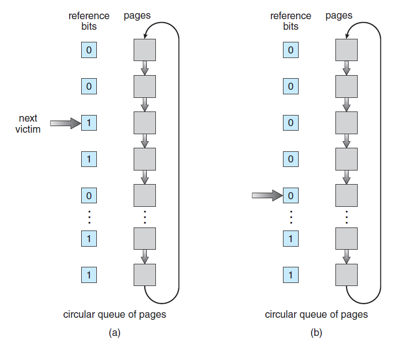
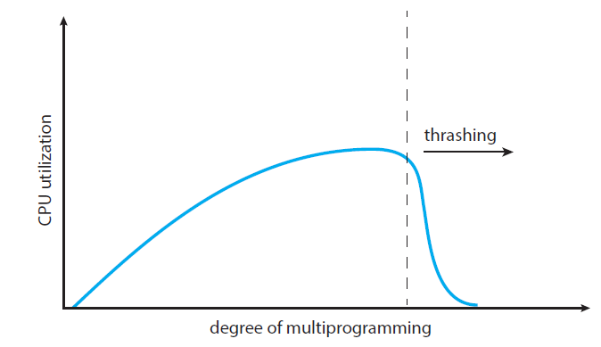

# 1. 페이지 교체
**페이지 교체가 필요한 상황은 보조기억장치에 있는 페이지를 메모리에 적재하고잘 할때 비어있는 프레임이 없을 때 발생**합니다. 

 

- 예를 들어 물리적인 메모리는 40개의 프레임을 가지고 있고 6개의 프로세스들은 각각 10페이지의 크기를 가지고 있습니다. 하지만 각각의 프로세스들은 실제로 수행시에는 5개의 페이지만을 사용합니다. 이렇게 되면 물리적인 메모리에는 30개의 프레임을 프로세스들이 사용하고 10개의 프리 프레임이 남아있을 수 있습니다.

- 그러나 모든 프로세스들이 급하게 모두 10개의 페이지를 원하게 되면 20개의 프리 프레임이 필요하게 되고 페이지를 교체해야하는 필요성이 발생합니다.

 

- 다음 그림은 2개의 프로세스가 각각 4개의 페이지를 가지고 프로세스를 실행시키는 도중에 물리적인 메모리 공간이 운영체제 공간을 제외한 6개 밖에 없어서 페이지의 교체가 필요한 상황을 표현한 것입니다.


- 위 그림을 통하여 프로세스1의 페이지 B를 실행시키고자 보조기억장치에서 물리적 메모리 위에 적재하고자 하는데 이미 물리적 메모리는 다른 페이지들로 점유되어 올릴 수 없는 상황입니다. 이러한 상황에서는 물리적 메모리 위에 있는 한 페이지를 다시 페이지 아웃시키고 페이지 B를 페이지 인해야합니다.

 

- 여기서 고려해야 할 점은 물리적 메모리 위에 이미 점유하고 있는 페이지들 중 어떤 페이지를 페이지 아웃시켜야 하는가입니다.

 

### 페이지 교체(Page Replacement)
- 페이지를 교체하기 위해서 현재 물리적인 메모리 위에서 사용하고 있지 않은 페이지를 탐색해야 합니다.  

 

- 다음은 페이지 교체의 수행과정을 표현한 것입니다.


1. 페이지 알고리즘에 의해 탐색된 사용하고 있지 않은 페이지를 페이지 아웃시켜서 보조기억장치로 이동시킵니다.
2. 페이지 테이블에 있는 페이지 아웃시킨 자리의 프레임 valid-invalid bit를 invalid bit로 변경합니다.
3. 실행시키고자 하는 페이지를 물리적인 메모리 위의 프레임 f에 적재
4. 해당 프레임 f의 valid-invalid bit를 valid bit로 변경하고 프로세스 수행을 재개합니다.
 
### 디맨드 페이징 구현을 위한 두가지 문제
1. 프레임-할당 알고리즘
  - 각각의 프로세스에 몇개의 프레임을 할당해주는 것이 효율이 좋아지는가?
2. 페이지-교체 알고리즘
  - 페이지 교체하기 위해서 어떤 페이지를 선택해야 효율이 좋아지는가?
 

### 페이지 교체 알고리즘의 평가기준 
1. 참조 문자열(Reference String) : 페이지 번호 단위로 나열한 문자열을 의미합니다.
  - 페이지 폴트(Page Faults)가 발생한 횟수를 계산합니다.
  - 페이지 폴트가 최소가 될 수록 좋습니다. 
  - 프레임의 개수가 많으면 많을수록 페이지 폴트의 발생 횟수는 줄어들 것입니다.

- 위 그림을 통하여 프레임의 개수가 많아지면 많아질수록 페이지 폴트의 발생 횟수는 낮아지는 것을 알수 있습니다.

 

### 알고리즘 평가를 위한 예제
```
Reference String : 7 0 1 2 0 3 0 4 2 3 0 3 0 3 2 1 2 0 1 7 0 1
메모리의 프레임 개수 : 3개
 ```


- 위 그림에서 7 -> 0 -> 1까지는 문제가 없으나 2번 페이지를 프레임 위에 놓고자 할 때 문제가 발생합니다. 위 상황에서 7 0 1중에서 어떤 페이지를 교체할 것인가가 페이지 교체 알고리즘의 핵심 내용입니다.

 

## 페이지 교체 알고리즘 : FIFO(First-In-First-Out) 페이지 교체
**FIFO 페이지 교체 방식은 가장 오래 있었던 페이지를 대상으로 교체**하는 것입니다. 다음 그림은 FIFO 페이지 교체 방식으로 알고리즘을 수행한 과정입니다.


- 위 수행과정을 통하여 FIFO 페이지 교체 방식은 15개의 페이지 폴트를 발생시켰습니다.

 

### Belady's Anomaly

- Belady's Anomaly 현상은 할당도니 프레임의 개수가 증가했음에도 페이지 폴트 발생 비율이 증가할 수 있는 현상을 의미합니다.
- 다음 그래프에 대한 참조 문자열은 "1 2 3 4 1 2 5 1 2 3 4 5"입니다.


- 위 참조 문자열에 대해서 FIFO 페이지 교체 방식을 적용하였을 때 프레임의 개수에 따른 페이지 폴트는 위와 같습니다.
- 주목할점은 프레임의 개수가 3개에서 4개로 증가했음에도 페이지 폴트의 발생 횟수가 증가한 부분입니다. 이와 같은 부분이 Belady's Anomaly 현상입니다.
 

### 최적의 페이지 교체 알고리즘은 무엇인가?

1. 페이지 폴트 발생 비율이 최소
2. Belady's anomaly 현상을 겪지 않는 알고리즘
 

### OPT(Optimal) or MIN 알고리즘
- OPT 또는 MIN은 앞으로 긴 주기동안 사용하지 않을 것 같은 페이지를 교체하는 방식입니다.
- OPT는 최소의 페이지 폴트 발생 비율을 보장할 것입니다.
 
### OPT 알고리즘 구현의 어려운점
- OPT 알고리즘은 어떤 페이지 참조를 기준으로 미래에 어떤 페이지가 접근하는지를 알아야 하기 때문에 이론적으로는 가능하나 실제로는 불가능한 알고리즘입니다. 하지만 이론적인 성능은 가장 좋기 때문에 다른 페이지 교체 알고리즘과 비교하는 용도로 사용됩니다.

 
**Optimal 페이지 교체 알고리즘의 수행과정**


- 4번째 과정에서 2번 페이지를 넣고자 할때 7번 페이지가 가장 안쓰이기 때문에 7번 페이지와 교체합니다.
- 페이지 폴트 발생 횟수 : 9회
 

### 페이지 교체 알고리즘 : LRU(Least Recently Used) 페이지 교체
- LUR 페이지 교체 방식은 최근에 가장 오랫동안 사용하지 않은 페이지를 교체하는 방식입니다.

 

- 다음은 LRU 페이지 교체 방식을 적용한 알고리즘 수행과정입니다.


- 4번째 과정에서 2번 페이지를 넣고자 할때 7번 페이지가 가장 오랫동안 사용되지 않았으므로 7번 페이지를 페이지 아웃시키고 2번 페이지를 페이지 인 합니다.
- 6번째 과정에서 3번 페이지를 넣고자 할때 1번 페이지가 가장 오랫동안 사용되지 않았으므로 1번 페이지와 교환합니다.
- 페이지 폴트 발생 횟수 : 12회
 

### LRU 페이지 교체를 위한 두가지 구현 방법

- 카운터(Counter) 기반  구현
  - 페이지가 참조될때마다 카운터를 복사합니다.
  - 값이 가장 작은 페이지를 교체합니다.
- 스택(Stack) 기반 구현
  - 페이지 번호의 스택을 유지합니다.
  - 스택의 중간에 있는 페이지 번호를 제거합니다.

- 위 그림을 통하여 a까지는 스택 상황이 4->7->0->1->2 였는데 7를 참조하였더니 중간에 있는 7을 빼서 다시 top에 올린 것을 볼 수 있습니다.  

 
### LRU-Approximation
- LUR는 하드웨어의 지원이 필요합니다. 그러나 많은 시스템들은 참조 비트(Reference Bit)의 도움을 제공합니다.
- 참조 비트(Reference Bit)
  - 각각의 페이지에 0으로 참조 비트를 초기화합니다.
  - 페이지가 참조되면 1로 설정됩니다.
  - 페이지가 교체되면 0으로 변경됩니다.
 

### Second-Change 알고리즘
- FIFO 페이지 교체 알고리즘을 기반으로 사용합니다.
- 그러나 페이지를 교체하고자 교채 대상 페이지를 선택할때 참조 비트(Reference Bit)를 검사하여 값이 0이라면 페이지를 교체하고 값이 1이라면 해당 페이지에게 두번째 기회를 주고 다음 FIFO 페이지에 해당하는 페이지를 선택합니다.두번째 기회를 받은 페이지의 참조 비트는 0으로 다시 설정합니다.
- 다음 그림은 Second-Change 알고리즘의 수행과정을 나타낸 것입니다.


- 위 그림을 보면 위에서 3번째 페이지와 4번째 페이지는 참조 비트가 전부 1이기 때문에 두번재 기회를 줍니다. 그래서 2번째 아래에 있는 참조 비트가 0인 페이지를 교체 대상 페이지로 선택합니다. 물론 두번째 기회를 받은 위에서 3번째, 4번째 페이지의 참조 비트는 0으로 갱신됩니다.

 

 

# 2. 프레임의 할당
### 프레임의 할당에 대한 문제
- 예를 들어 어떤 시스템은 128개의 프레임을 가지고 있고 운영체제가 35프레임을 차지하고 남은 93개의 프레임은 사용자 프로세스를 위해서 사용됩니다. 순수한 디맨드 페이징(Pure-Demand-Paing)을 사용하였을때 93개의 프레임 요소가 있는 Free-Frame List를 사용할 수 있습니다.

 

- 첫 93개의 페이지 폴트가 발생하고 94번째 페이지 폴트는 페이지 교체가 발생할 것입니다. 만약 두 프로세스 각각이 128개의 페이지를 가지고 있다고 가정하면 두 프로세스에게 어떻게 93개의 프레임을 할당할 것인가가 문제입니다.

 

 

### 프레임 할당 전략
1. 프레임의 할당량 방식
  1. 동등 할당(Equal Allocation) : 모든 프로세스들에게 동등하게 프레임들을 똑같이 할당함
  2. 비례적인 할당(Proportional Allocation) : 프로세스의 크기에 따라서 프레임을 차등 할당함
2. 프레임 선택 할당 범위
  1. 지역 교체(Local Replacement) : 프로세스 별로 할당된 프레임의 크기가 고정되어 있기 때문에, 페이지 폴트가 발생하면 프로세스 안에서 페이지 교체 정책을 통해 자체적으로 메모리를 확보하는 방식입니다.
     - 예를 들어 100개의 프레임이 있고, 5개의 프로세스가 존재한다면 한 프로세스마다 20개의 페이지 공간을 할당해주는 방식입니다.
  2. 전역 교체(Global Replacement) : 프로세스의 우선순위를 따져서 각 프로세스에게 동적으로 우선순위 할당을 하는 방식입니다. 만약 페지이 폴트가 발생하면 다른 프로세스가 가지고 있던 프레임을 선점하여 사용할 수 있습니다.
    - 예를 들어, 전체 프레임의 수가 64개이고 프로세스1,2의 사이즈가 각각 s1, s2라면 프로세스 1에게 64*(s1/(s1+s2)) 만큼의 프레임을 할당합니다. 물론 다른 방식으로 우선순위 할당을 할 수 있습니다.
 
# 3. 쓰레싱(Thrashing)
### 쓰레싱이란 무엇인가?
- 쓰레싱은 **프로세스들이 자신의 작업을 처리하지 못하고 페이지 폴트로 인하여 페이지 교체 혹은 프레임의 재할당 등을 하는데 시간을 계속 투자하는 상황**을 말합니다.
- 다음 그림은 멀티 프로그래밍의 개수가 늘어날 수록 CPU 이용률의 그래프입니다. 


- 위 그림을 보면 멀티 프로그래밍의 개수가 올라가면 올라갈수록 CPU 이용률이 증가하지만 어느 일정 순간이 되면 CPU 이용률이 떨어지는 것을 볼 수 있습니다. 떨어지는 특이점이 바로 쓰레싱(Thrashing)입니다.