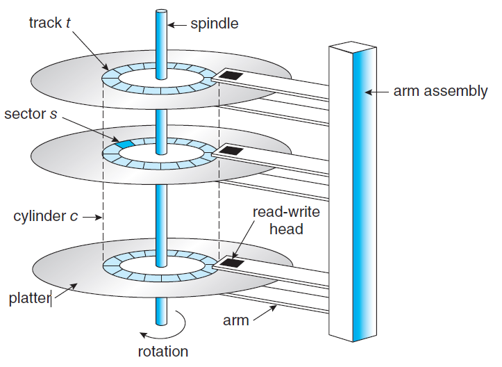
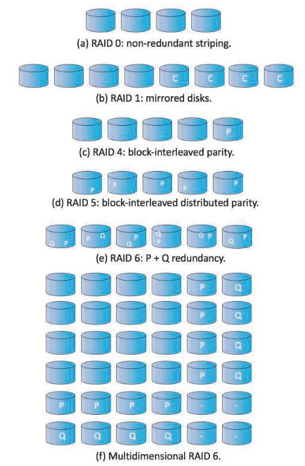

1. HDD(Hard Disk Drive)의 구조
- 다음 그림은 하드디스크의 구조를 나타낸 그림입니다.

- Spindle : 시스템 부팅 후에 Disk의 내용을 읽고 쓰기 위해서 반드시 Spindle이라는 회전축으로 디스크를 회전시켜야합니다.
- Platter : 데이터들이 집합되어 있는 원형 모양의 디스크입니다. 각 디스크들은 여러개의 트랙으로 이루어져 있습니다. 이때 Track의 최소 단위는 Sector로써, Sector는 각각의 데이터들을 담고 있습니다.
- Arm : Arm은 직접 데이터를 읽어들이는 부분으로, Arm의 끝에 read/write head가 위치하여 실질적으로 데이터를 읽어들입니다.
- Cylinder : 각 디스크에서 동일한 거리에 있는 3개의 Track들을 연결해보면 원통 모형처럼 생겼기 때문에 Cylinder라고 명명합니다. read/write head가 서로 다른 Cynlinder를 가리킬순 없습니다. Arm들은 서로 동기화되어 같은 Cylinder를 가리킵니다.
 

# 2. HDD Scheduling
- HDD 스케줄링의 목표
  1. 접근 시간(Access Time) 또는 탐색 시간(Seek Time)을 최소화
  2. 데이터 전송의 대역폭을 최대화
- Seek Time : head가 요청한 sector가 위치한 track까지 arm을 뻗는데 걸리는 시간, 가장 오래걸리는 시간이며 seek time을 줄이는게 access time을 줄이는 핵심입니다.
- Rotational Latency : 해당 sector가 read-write head의 밑으로 회전하는데 걸리는 시간
- Transfer Time : 데이터를 읽고 전송하는데 걸리는 시간
- Access Time   : access time = seek time + rotational latency + transfer time
 

# 3. HDD Scheduling 종류
- FIFO Scheduling
- SCAN Scheduling
- C-SCAN Scheduling
 

## 3.1 FIFO Scheduling
- **FIFO 스케줄링 방식은 들어온 순서대로 헤드를 움직이는 방식**입니다.
- FIFO 스케줄링은 공정한 방법이지만 빠른 서비스를 기대할 수는 없습니다.

-위 그림은 53에서 헤드를 출발하여 FIFO 스케줄링 방식으로 HDD를 탐색한 그림입니다. 이동한 실린더는 총 640 실린더의 헤드를 움직였습니다.

 

## 3.2 SCAN Scheduling
- **SCAN 스케줄링 방식은 디스크 암이 디스크의 한쪽 끝에서 출발하여 다른쪽 방향으로 움직이는 방식**입니다.
- 각각의 실린더에 도달할때까지 요청을 처리합니다.
- 한쪽 끝에 도달한 경우 헤드가 반대방향으로 다시 진행합니다.
- 예를 들어 헤드의 방향이 0번쪽으로 간다고 가정한다면 다음 그림처럼 헤드의 이동은 236 실린더의 헤드가 움직일 것입니다.

### 1.5 C-SCAN(Circular-SCAN) Scheduling
- C-SCAN 스케줄링 방식은 더욱 균일한 대기 시간을 제공하기 위해서 SCAN 스케줄링 방식을 변형시킨 방식입니다.
- SCAN 스케줄링 방식은 헤드가 한쪽 끝에 도달하면 역방향으로 움직입니다. 그러나 **C-SCAN 스케줄링 방식은 디스크의 한쪽 끝에서 다른쪽으로 헤드를 움직이는 방식입니다. 한쪽 끝에 도달하면 다시 헤드가 시작했던 방향에서 움직입니다**.
- 그러나 헤드가 한쪽 방향에 도달하면 디스크의 시작점으로 즉시 되돌아갑니다. 이때는 서비스 요청을 처리하지 않습니다.

- 위의 그림을 보면 53에서 출발하여 199에 도달하면 0부터 다시 탐색을 시작합니다. 이때 0으로 되돌아오는 부분에서는 서비스 요청을 처리하지 않습니다. 위 큐를 C-SCAN 스케줄링 방식으로 처리하면 183 실런더의 헤드를 움직입니다.

 

# 4. Boot Block
- 컴퓨터 시스템을 실행시키려면 전원이 켜질 때 실행할 초기 프로그램이 있어야합니다.
- 부트스트랩 로더(Bootstrap loader)는 보조기억장치에 저장되어 있고 메모리에 위에 올라갑니다. 그리고 부트스트랩 로더는 보조기억장치에 있는 운영체제 커널을 복사해서 메모리 위에 올리고 난 다음 제어권을 운영체제에게 양도합니다.
- 즉, **Book Block은 컴퓨터가 부팅 될때 시스템에 OS를 설치하기 위해서 필요한 정보들이 저장되어 있는 디스크 영역이 부트 블록**입니다. 다시 말해 OS가 디스크를 포함한 시스템을 제어하기 위해 필요로 하게 되는 정보들이 저장되어 있는 블록입니다.

 

# 5. RAID(Redundant Arrays of Independent Disks)
 

## 5.1 RAID의 개념 및 특징
- **RAID는 여러개의 디스크를 묶어서 하나의 디스크처럼 사용하는 기술**입니다.
- RAID를 사용함으로써 하나의 드라이브가 고장나더라도 데이터의 분실로 이어지지 않습니다.
 

## 5.2 RAID의 목적
- 처리량(Throughput) 향상 : **디스크들을 병렬적으로 수행하여 데이터의 읽기/쓰기에 대한 처리량을 증가**시킵니다. 처리량을 향상시키기 위해서 Striping 기법을 사용합니다.
  - **Striping 기법** : 하나의 파일을 여러개의 디스크에 걸쳐서 저장하는 기술입니다.
- 신뢰성 향상 : 데이터를 복제하여 다수의 디스크에 저장하여 만에 하나라도 **디스크가 고장나더라도 데이터를 읽어버리지 않게 합니다.** 신뢰성을 향상시키기 위해서 Fault-Tolerance 기법을 사용합니다.
  - **Fault-Tolerance 기법** : 데이터를 복제하여 저장해두는 **미러링(Mirroring) 기법**과 패리티 블록(Parity Block)을 사용하는 **패리티(Parity) 방식**이 있습니다.
 

## 5.3 RAID 처리량(Throughput)
- RAID에서는 A라는 파일을 A1, A2, A3 ... 등으로 여러개의 디스크에 분할하여 저장합니다. 이를 Striping이라고 하는데, Striping의 단위 크기에 따라 bit-level striping / block level striping으로 나뉘게 됩니다.

- bit-level striping      : 각 바이트의 비트를 여러 디스크에 나눕니다. 예를들어 8개의 디스크의 배열안에서, 각 바이트의 i번째 bit은 i번재 디스크에 쓰이고 각 액세스는 단일 디스크의 8배 속도로 데이터를 읽을 수 있습니다.
- block level striping  :  n개의 디스크에서 파일의 i번째 블록은 disk (i mod n) +1에 쓰입니다. 블록이 서로 다른 디스크에 있는 경우 여러 블록에 대한 요청이 병렬로 실행될 수 있습니다.

 

## 5.4 RAID 신뢰성(Reliability)
- N개의 디스크에서 장애가 발생할 확률은 단일 디스크의 장애 확률보다 더 높습니다.
  - 예를 들어 고장이 날때까지 걸리는 시간인 MTBF(Mean Time Between Failures)가 100,000시간이라고 가정합니다.
  - 100개의 디스크에서 MTBF = 100,000 / 100 = 1,000시간이므로 100개의 디스크를 사용한다면 장애가 발생할 확률은 1000시간에 한번씩 발생하여 단일 디스크를 사용하는 것보다 100배는 많이 발생할 것입니다. 
- 신뢰성을 높이기 위해서는 중복성(Redundancy)를 이용합니다. 데이터를 중복하여 여러 군데에 저장해 놓는 것을 의미합니다. 대표적으로 **미러링(Mirroring) 방식, 패리티(Parity) 방식** 두가지 방식을 사용할 수 있습니다.
 

### 5.4.1 미러링(Mirroring) 방식
- **한 디스크가 고장이 났을 때, 만약 다른 디스크에 해당 디스크의 정보들을 복제해서 저장해두었다면, 그대로 그 디스크에 접근하여 사용하는 방식**입니다.

 

- 만약 복제 디스크도 고장이 났다면, 데이터를 아예 손실된 것이므로, 원래 디스크가 고장이 나면 남아있는 디스크에 복제된 디스크를 이용해 해당 **데이터를 모두 옮깁니다. 이때 해당 데이터를 옮겨 복구하는 시간을 mean time to repair라고 합니다.**

 
### 5.4.2 패리티(Parity) 방식
- 패리티 방식의 Fault-Tolerance 기법은 XOR연산을 통해 이루어집니다. 3개의 디스크 A,B,C가 있다고 가정하고 A라는 디스크가 고장나면 A의 내용을 복구해야 합니다. 이때 C 디스크에 A XOR B 연산을 수행한 결과를 다시 B와 XOR 연산하면 A 디스크의 내용을 복구 할 수 있습니다.

 

# 6. RAID Levels
## 6.1 RAID Levels은 무엇인가?
- RAID Levels은 비용이 많이 들지만 성능이 좋은것(Cost-Performance)과 비용은 적지만 성능이 낮은 것(Trade-Offs)을 비교한 것에 따른 종류를 분류하는 것입니다.

 
- RAID 0 : 디스크가 중복된 부분이 없는 상태이며, 만약 디스크가 고장나면 복구가 불가능합니다.
- RAID 1 : 모든 디스크가 미러링되어 복사된 상태이고, 저장 용량이 원래 디스크 사이즈의 두배만큼 필요합니다.
- RAID 4 : parity 방식 + bit-level striping 방식으로 데이터를 저장합니다.
- RAID 5 : parity 방식 + block-level striping 방식으로 데이터를 저장합니다.
- RAID 6 : 패리티 비트 P, Q를 다수의 디스크에 분산하여 저장하는 방식
- Multidemensional RAID 6 : 다차원 배열을 만들어서 패리티 P와 Q를 별도의 디스크에 저장하는 방식

 