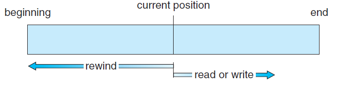
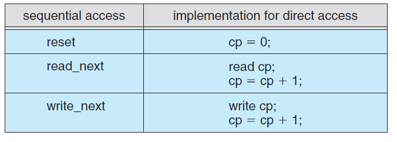
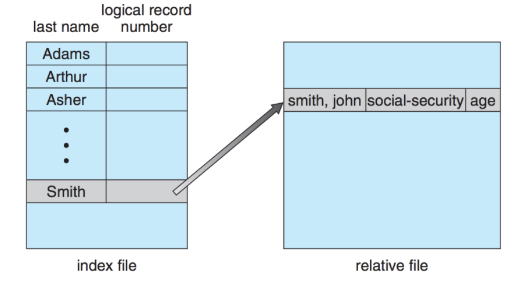
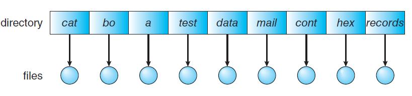
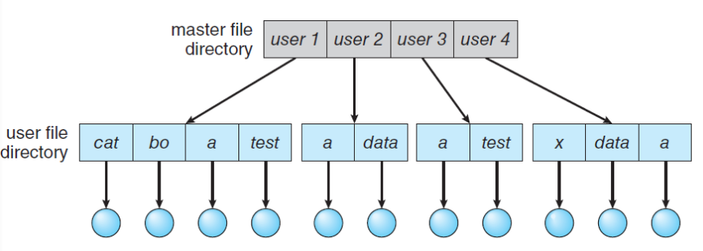
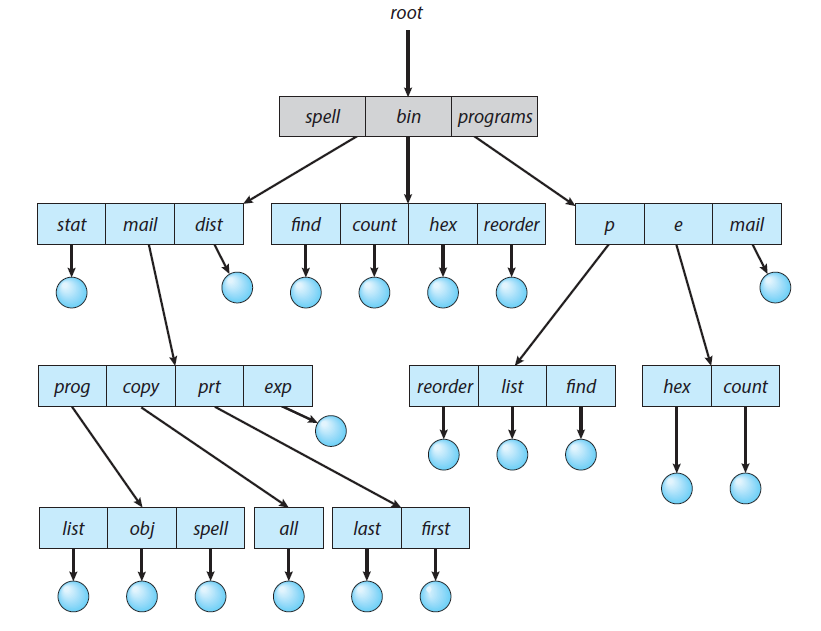
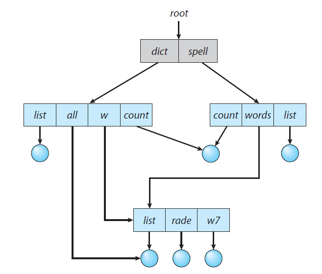
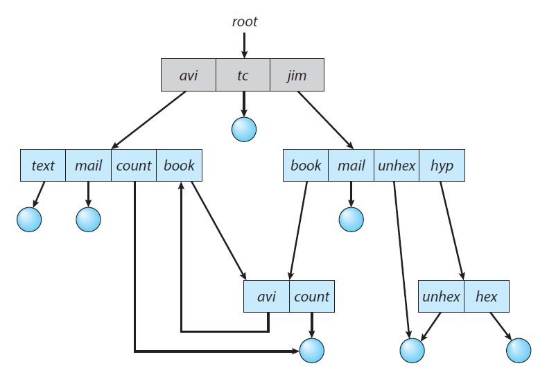

# 1. 파일 시스템(File System)
- 파일 시스템은 운영체제와 모든 데이터, 프로그램의 저장과 접근을 위한 기법을 제공합니다.
- 시스템 내의 모든 파일에 관한 정보를 제공하는 계층적 디렉터리 구조이고, 파일 및 파일의 메타데이터, 디렉터리 정보등을 관리합니다.
 

# 2. 파일 시스템 접근 방법
## 2.1 순차적 접근(Sequential Access)
- 가장 단순한 방법으로써 파일의 정보가 레코드 순서대로 처리되는 방식입니다. 카세트테이프를 사용하는 방식과 동일합니다.
- 현재 위치에서 읽거나 쓰면 offset이 자동으로 증가하고, 뒤로 돌아가기 위해선 되감기가 필요합니다.

 
## 2.2 직접 접근(Random Access)
- 파일의 레코드를 임의의 순서로 접근할 수 있습니다. LP판을 사용하는 방식과 동일합니다.
- 읽기나 쓰기의 순서에 제약이 없으며 현재 위치를 유지할 수 있다면 이를 통해 순차 접근 기능도 구현할 수 있습니다.

 

## 2.3 색인 접근(Index Access)
- 파일에서 레코드를 찾기 위해 색인을 먼저 탐색하고 대응되는 포인터를 얻는 방식입니다. 이를 통해 파일에 직접 접근하여 원하는 데이터를 얻을 수 있습니다. 크기가 큰 파일에서 유용한 방식입니다.

 

# 3. 디렉토리 구조(Directory Structure)
- 디렉토리는 파일 이름을 파일 제어 블록으로 변환하는 기호 테이블로 볼수 있습니다.
- 디렉토리 구조를 구성하는 방법은 4가지가 있습니다.
  1. Single-Level Directory
  2. Two-Level Directory
  3. Tree-Structured Directories
  4. Acyclic-Graph Directories
  5. General-Graph Directories
 

## 3.1 Single-Level Directory

- Single-Level Directory 방식은 모든 파일들이 디렉터리 밑에 존재하는 형태입니다. 파일들은 서로 유일한 이름을 가지고 서로 다른 사용자라도 같은 이름을 사용할 수 없습니다. 하지만 지원하기 쉽고 이해하기도 쉽지만, 파일이 많아지거나 다수의 사용자가 사용하는 시스템에서는 제약을 갖을 수밖에 없습니다.

 

 

## 3.2 Two-Level Directory

- Two-Level Direcoty는 각 사용자별로 별도의 디렉터리를 갖는 방식입니다.

- **UFD(user file directory)** : 자신만의 사용자 파일 디렉터리
- **MFD(master file directory)** : 사용자의 이름과 계정 번호로 색인되어 있는 디렉터리, 각 엔트리는 사용자의 UFD를 가리킵니다.
- 서로 다른 사용자가 같은 이름의 파일을 가질 수 있고, 효율적인 탐색이 가능합니다. 하지만 그룹화가 불가능하고, 다른 사용자의 파일에 접근해야 하는 경우에는 단점이 됩니다.

 

## 3.3 Tree-structured Directories

- 사용자들이 자신의 서브 디렉토리를 만들어서 파일을 구성하는 방식입니다. 하나의 루트 디렉터리를 가지며 모든 파일은 고유한 경로(절대/상대경로)를 가집니다. 이를 통해 효율적인 탐색이 가능하고, 그룹화가 가능합니다. 

- 디렉터리는 일종의 파일이므로 일반 파일인지 디렉터리인지 구분할 필요가 있습니다. bit를 사용하여 0이면 일반 파일, 1이면 디렉터리로 구분합니다.

## 3.4 Acylic-graph Directories(비순환 그래프 디렉터리)

- 디렉터리들이 서브 디렉터리들과 파일을 공유할 수 있도록 합니다. 트리 구조의 디렉터리를 일반화한 형태입니다. 단순한 트리 구조보다는 더 복잡한 구조이기 때문에 몇몇 문제가 발생할 수 있습니다. 

 

- 파일을 삭제하게 되면 현재 파일을 가리키는 포인터는 대상이 사라지게 됩니다. 따라서 참조되는 파일에 참조 계수를 설정하여, 참조 계수가 0이 되면 파일을 참조하는 링크가 존재하지 않는다는 의미이므로 그때 파일을 삭제할 수 있도록 합니다.
 
## 3.5 General-graph Directories
 

- 순환을 허용하는 그래프 구조입니다. 순환이 허용되면 무한 루프에 빠질 수 있습니다. 따라서 하위 디렉터리가 아닌 파일에 대한 링크만 허용하거나 가비지 컬렉션을 통해 전체 파일 시스템을 순회하고, 접근 가능한 모든 것을 표시합니다.

 