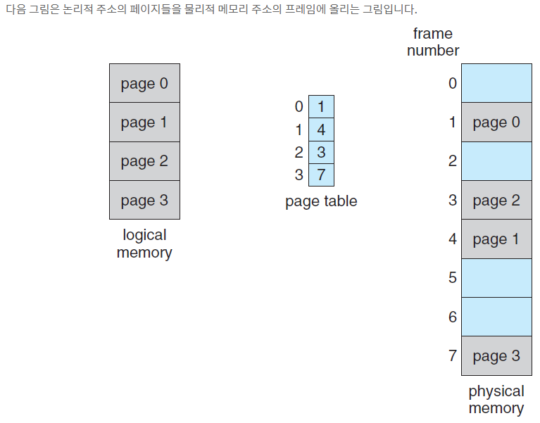
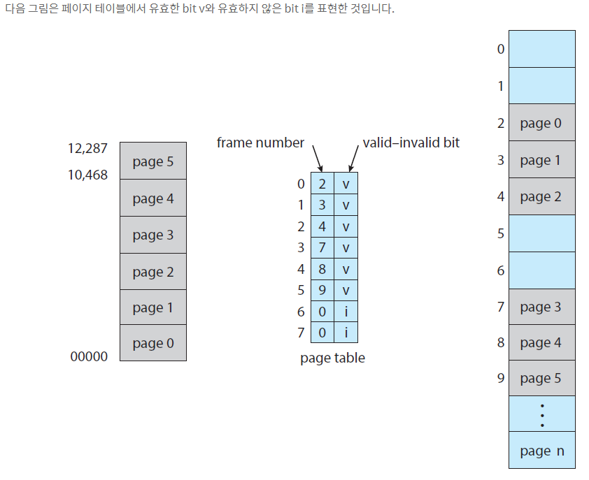

# 1. 페이징(Paging)
### 페이징의 필요성
- 프로세스를 메모리에 올릴 때 가장 좋은 시나리오는 메모리에서 연속적인 위치에 그대로 올라가는 것입니다. 하지만 프로세스의 크기가 커지면 커질수록 연속적인 위치에 놓지 못하게 됩니다. 이렇게 되면 메모리 위에서 프로세스는 쪼개지는 외부 단편화 현상이 발생합니다.

### 페이징이란 무엇인가?
- 프로세스의 물리적 주소 공간을 비연속적으로 허용하는 메모리 관리 체계입니다.
- 연속적인 메모리 할당의 2가지 문제를 극복합니다.
  1. 외부 단편화(external fragmentation) 회피합니다.
  2. 압축과 관련된 요구를 회피합니다.
- 운영체제와 하드웨어 사이에서 협력하여 구현함

### 페이징의 기본적인 방법
1. 물리적인 메모리를 고정된 크기의 블록(frames)으로 분할합니다.
2. 논리적인 메모리를 같은 크기의 블록(pages)으로 분할합니다.

예를 들어 메모리의 크기가 1GB 크기라고 가정합니다. 그리고 물리적인 메모리를 1KB 단위로 분할하여 frames으로 만든다면 1GB = 1024KB * 1024 = 1,048,576KB이므로 대략 100만개의 frames 블록이 생성됩니다. 그리고 프로세스의 크기는 64KB라고 가정합니다. 이렇게 되면 **프로세스는 64개의 frames**가 있게됩니다. 그런다음 64개의 frames를 물리적인 메모리에 올리게 됩니다. 여기서 주목할점은 64개의 frames로 분할했기 때문에 **메모리 위에서 연속적일 필요는 없다는 점**입니다.

- CPU에 의해서 생성된 모든 주소는 2가지 부분으로 나뉩니다.
  - 페이지 번호(page number, p)
  - 페이지 오프셋(page offset, d)
  - 

### 페이지 번호
- 페이지 번호는 프로세스마다 페이지 테이블에 대한 인덱스로 사용됩니다.
- 논리적인 주소의 페이지 번호는 물리적인 주소의 프레임 번호로 매핑됩니다.
- 논리적인 주소의 페이지 오프셋을 프레임의 시작 위치에 더하여 접근합니다.
- 

### 논리적 주소를 물리적 주소로 변환하기 위한 단계
1. 페이지 번호 p를 추출한 다음 페지이 번호 p는 페이지 테이블의 인덱스로써 사용합니다.
2. 페이지 테이블로부터 페이지 번호 p에 따른 프레임 번호 f를 추출합니다.
3. 페이지 번호 p를 프레임 번호 f로 변경합니다.

- page 0번의 인덱스는 0으로써 page table의 0번 인덱스를 찾아갑니다.
- page 0의 프레임 번호는 1번으로써 물리적인 메모리의 프레임 1번에 올립니다.

### 페이지 크기
- 페이지의 크기는 하드웨어에 의해서 정의됩니다.
- 논리적 주소 공간의 크기가 2^m이고 페이지의 크기가 2^n이라면 페이지 번호의 최대 필요 bit수와 페이지 오프셋의 최소 필요 bit수는 다음과 같습니다.
  - 페이지 번호의 최대 필요 bit 수 : m - n bit
  - 페이지 오프셋의 최소 필요 bit 수 : n bit
  - 예를 들어 m=10이라면 논리적 주소 공간은 2^10이고 n=2라면 페이지의 총 크기는 4입니다.
  - 페이지번호는 8bit로 표현하고 페이지 오프셋은 2bit로 표현합니다.

### 실행할 시스템에 프로세스가 도착한 경우

### 하드웨어의 지원
- CPU 스케줄러가 실행을 위해서 프로세스를 선택할때 페이지 테이블을 문맥 교환(Context Switch) 하는 동안 다시 불러와야 합니다. 왜나하면 그 페이지 테이블이 계속 유지될꺼라는 보장이 없기 때문입니다.
- 그래서 페이지 테이블을 가리키는 포인터는 각각의 프로세스의 PCB에 다른 레지스터 값들과 같이 저장되어야 합니다. 페이지 테이블 포인터를 사용하는 이유는 프로세스가 커지면 커질수록 페이지 테이블 자체를 다시 불러오는 것이 비용이 많이 들기 때문입니다. 그래서 이 문제를 해결하기 위해서 PTBR(page-table base register)를 이용합니다.

### PTBR(Page-Table Base Register)
- PTBR은 페이지 테이블의 시작 위치를 가리키는 포인터입니다.
- 페이지 테이블 자체는 메인 메모리에서 유지됩니다.
- 프로세스간의 문맥 교환할때 빠르지만 메모리 접근 시간은 느립니다.
- 메모리 접근이 2번 필요하다는 단점이 있습니다.
  - 페이지 테이블 엔트리를 위해서 한번
  - 실제 데이터(프레임 블록)를 위해서 한번
 
### Translation Look-aside Buffer (TLB)

- TLB는 페이지 테이블의 캐시 역할을 수행합니다.
- 하드웨어인 캐시 메모리를 사용합니다.

###  TLB를 사용한 효율적인 메모리 접근 시간
- TLB hit : 만약 TLB안에 찾고자 하는 페이지 번호가 있는 경우 - TLB hit라고 표현합니다.
- TLB miss : 만약 TLB안에 찾고자 하는 페이지 번호가 없는 경우 TLB miss라고 표현합니다. 
- hit ratio : TBL에서 찾고자 하는 페이지 번호를 찾은 횟수 비율
- 예를 들어 어떤 시스템의 메모리에 접근하는 10나노초 걸린다고 가정합니다. TLB를 거치지 않고 페이지 테이블을 거치는 시간은 20나노초 걸린다고 가정합니다. hit ratio에 따른 접근 시간은 다음과 같습니다.
  - 80% hit ratio : EAT = 0.80 * 10 + 0.20 * 20 = 12ns.
  - 99% hit ratio : EAT = 0.99 * 10 + 0.01 * 20 = 10.1ns.

### 페이징을 통한 메모리 보호
- 페이징을 통한 메모리 보호는 각각의 프레임 블록과 연관된 보호 비트(protection bit)에 의해서 할 수 있습니다.
- valid-invalid bit : 하나의 추가적인 비트입니다. 일반적으로 페이지 테이블에서 각각의 엔트리에 첨부됩니다.
- 해당 bit가 유효한 비트로 설정된 경우 연관된 페이지는 프로세스의 논리적 주소 공간에 있는 것을 의미합니다. (legal)
- 해당 bit가 유효하지 않은 비트로 설정된 경우 해당 페이지는 프로세스의 논리적 주소 공간에 있지 않는 것을 의미합니다. (illegal)
- 불법적인(illegal) 주소들은 valid-invalid bit의 사용에 의해서 걸리게 됩니다.

### 공유된 페이지(Shared Pages)
- 페이징의 장점은 멀티프로그래밍 환경에서 공통 코드를 공유할 수 있습니다.
- 표준 C 라이브러리 libc를 모든 프로세스가 각자의 libc 복사본을 프로세스 주소 공간에 가지고 있다고 가정합니다. 이는 매우 비효율적입니다. 그래서 만약 libc 라이브러리 같은 코드처럼 Reentrant Code라면 공유할 수 있습니다.
- Reentrant Code는 실행중에 자기를 바꿀일이 없는 코드를 의미합니다.
- 
- process P1에 있는 라이브러리(libc1,2,3,4, ...)들이 해당 P1의 페이지 테이블에 매핑되어 있습니다.
- process P2와 process P3도 마찬가지로 페이징 테이블에 매핑이 되어 있는데 주목할점은 process P1의 페이지 테이블의 엔트리와 동일하다는 점입니다.
- P1, P2, P3는 물리적인 메모리 주소 공간을 동일하게 가리키고 있기 때문에 공유 될수 있는 것입니다.

# 4. 페이지 테이블 구성
- 큰 논리적 주소 공간은 페이지 테이블 자체가 지나치게 커지게 되는 문제가 있습니다.
- 페이지 테이블 구성을 위한 몇가지 필요한 기술
  - Hierachical Paging
  - Hashed Page Table
  - Inverted Page Table

### Hierachical Paging
- 논리적 주소 공간을 다수의 테이블로 다시 분할하는 방식입니다.
- 
- 

### Hashed Page Tables
- 논리적 주소 공간의 페이지번호와 페이지 오프셋의 조합을 통해서 해시값 r에 매핑하여 물리적인 주소에 올립니다.
- 주소 공간이 32bit 보다 큰 경우에 사용하면 효율적입니다.
- 해시 테이블을 사용하여 가상 페이지 번호를 관리합니다.

### Inverted Page Tables
- 페이지를 가지고 있는 대신에, 프로세스에 대한 정보를 포함된 가상 주소로 구성된 각각의 실제 페이지에 대해 반전된 페이지 테이플을 사용합니다.
- 

## Swapping
- Swapping은 시스템의 실제 물리적인 메모리를 뛰어넘어 모든 프로세스들의 전체 물리적인 주소 공간을 넘는 더 많은 논리적인 주소 공간을 갖게 하는 것을 가능하게 합니다.
- 예를 들어 프로세스의 크기가 5GB이고 메모리의 크기가 4GB일때 가능하게 합니다. 아이디어는 메모리에 프로세스의 써야할 부분만 올리고 프로세스의 다른 부분과 교환하여 메모리에 올려서 사용하는 것입니다.
- 프로세스의 명령어와 데이터는 메모리 안에서 실행되어야 합니다. 그러나 Swapping 기술을 이용하면 프로세스 전체 또는 일부를 메모리에 올려둬서 교환하면서 메모리 크기보다 더큰 프로세스를 실행시킬 수 있습니다.
 
### Standard Swapping
- Swap Out : 프로세스 전체를 메인 메모리에서 Backing Store로 내보내는 것
- Swap In    : 프로세스 전체를 Backing Store에서 메인 메모리로 올리는 것
- 문제는 전체적인 프로세스를 메모리와 Backing Store 사이에서 교환하는 것은 비용이 너무 많습니다.

### Paging을 이용한 Swapping
- 프로세스의 페이지는 전체 프로세스 대신에 교환할 수 있습니다.
  - 이 전략은 여전히 물리적인 메모리가 달성할 수 있습니다.
  - 그러나 오직 페이지의 적은 개수를 교환할 수 있습니다.
- 오늘날 페이징을 이용한 Swapping을 페이징(paging)이라고 부릅니다.
  - page out : 하나의 페이지를 메모리에서 Backing Store로 내보냅니다.
  - page in   : 하나의 페이지를 Backing Store에서 메모리로 가져옵니다.
- 페이징은 가상 메모리 기술에서 큰 성능을 발휘합니다.
- 